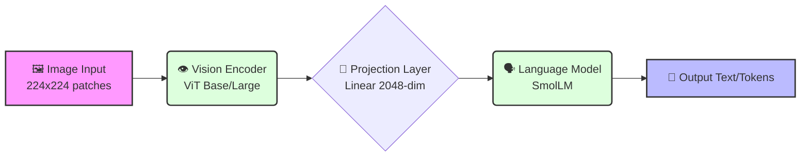

<div align="center">

# 🌌 VLM Mastery
**Master Vision-Language Models by building them from the ground up.**

[](https://python.org)
[](https://pytorch.org)
[](https://opensource.org/licenses/MIT)
[](https://ShivamTheCodingDon.github.io/VLM-Mastery/)

A comprehensive 12-part journey from a simple image captioner to advanced multi-modal AI systems. **No magic, no black boxes** — just pure understanding.

[**Explore the Interactive Website**](https://ShivamTheCodingDon.github.io/VLM-Mastery/)
<br/>

</div>

---

## 🗺️ The Journey

We have meticulously organized the 12 parts into modular learning categories so you can progress at your own pace:

### 🏗️ 01. Fundamentals
| Topic | What You'll Build |
|:------|:------------------|
| [**Minimal VLM**](01-Fundamentals/01-Minimal_VLM.ipynb) | Connect a Vision Transformer to a Language Model. Train on Flickr8k. Generate your first captions. |

### 👁️ 02. Core Vision Tasks
| Topic | What You'll Build |
|:------|:------------------|
| [**Object Detection**](02-Core_Vision_Tasks/01-Object_Detection.ipynb) | Instruction-tune for detection. Output structured JSON. Predict bounding boxes. |
| [**Visual QA**](02-Core_Vision_Tasks/02-Visual_QA.ipynb) | Answer questions about images. Train on A-OKVQA. Build visual understanding. |
| [**Referring Segmentation**](02-Core_Vision_Tasks/03-Referring_Segmentation.ipynb) | "The dog on the left" → polygon mask. Visual grounding meets segmentation. |

### 🧠 03. Advanced Interactions
| Topic | What You'll Build |
|:------|:------------------|
| [**Multi-Task**](03-Advanced_Interactions/01-Multi_Task.ipynb) | One model, three tasks. Unified architecture for captioning, detection, and VQA. |
| [**Multi-Image**](03-Advanced_Interactions/02-Multi_Image.ipynb) | Process image sequences. Temporal reasoning. Inspired by TEOChat. |
| [**Task Routing**](03-Advanced_Interactions/03-Task_Routing.ipynb) | Auto-detect task from prompt. Intelligent routing. Seamless UX. |
| [**Chain of Thought**](03-Advanced_Interactions/04-Chain_Of_Thought.ipynb) | Step-by-step visual reasoning. Think before answering. Improved accuracy. |

### 🎨 04. Generative & Editing
| Topic | What You'll Build |
|:------|:------------------|
| [**Image Editing**](04-Generative_and_Editing/01-Image_Editing.ipynb) | Natural language edits. "Make it brighter" → transformed image. VLM + PIL. |
| [**Image Generation**](04-Generative_and_Editing/02-Image_Generation.ipynb) | VLM meets Stable Diffusion. Understand to create. Full circle. |

### ⚡ 05. Optimization & Specialized
| Topic | What You'll Build |
|:------|:------------------|
| [**Compression**](05-Optimization_and_Specialized/01-Compression.ipynb) | Quantization, pruning, distillation. 8x smaller. Production-ready. |
| [**OCR to LaTeX**](05-Optimization_and_Specialized/02-OCR_LaTeX.ipynb) | Math equations in images → LaTeX code. TrOCR architecture. |

---

## 🏗️ The Architecture



- **Vision Encoder**: ViT-Base/Large (86M-304M params)
- **Language Model**: SmolLM-135M/360M
- **Training Stack**: PyTorch, HuggingFace Transformers
- **Datasets Used**: Flickr8k, A-OKVQA, RefCOCO, COCO

---

## 🚀 Getting Started

To get started with the notebooks, clone the repository and install the dependencies:

```bash
# 1. Clone the repository
git clone https://github.com/ShivamTheCodingDon/VLM-Mastery.git

# 2. Move into the directory
cd VLM-Mastery

# 3. Install dependencies
pip install -r requirements.txt
```

> **💡 Tip:** We recommend navigating through the categories in order, beginning with **01-Fundamentals/01-Minimal_VLM.ipynb**.

---

## 🔧 Prerequisites

- **Python 3.8+** (Comfortable with classes, functions, list comprehensions)
- **PyTorch 2.0+** (Tensors, autograd, nn.Module basics)
- **GPU** with ~4GB VRAM recommended (Google Colab works great too!)
- **Deep Learning Basics** (Loss functions, backprop, training loops)

---

## 📜 Philosophy & License

Every line of code is written from scratch and explained. By the end of this journey, you'll understand how modern VLMs work at a fundamental level.

MIT License - Feel free to use for educational purposes! Built with curiosity.
